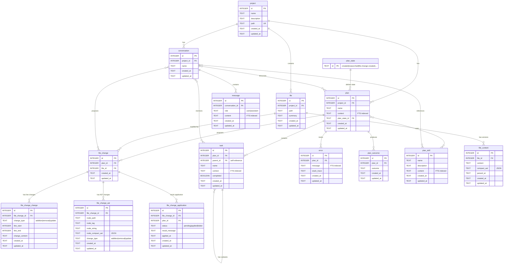

# Clojure Software Builder

This tool is designed to help you get the most out of working with LLM
agents and the clojure programming language.

## Techonology

- Clojure: Core techonology
- TypedClojure: Static verification of Clojure
- SQLite: Primary Storage. JSON and Full text storage
- Datastar: Primary UI
- Hiccup: Generate HTML
- HTTP-Kit: HTTP Server
- rewrite-clj: CLojure parser

## Data Model

### Schema Overview

### Key Features

- **Foreign Keys**: Enabled globally with CASCADE deletes
- **Full-Text Search (FTS5)**: On plan.context, task.context, plan_skill.content, error.message, message.content
- **Timestamps**: Automatic created_at/updated_at on all tables
- **Indexes**: Comprehensive indexing on all foreign keys and frequently queried columns
- **Constraints**: CHECK constraints on enums (role, change_type, status)
- **Versioning**: file_content supports multiple versions per file

## Core features

Command line tool

- skill
- plan
- task
- file
- file-change

## Development

This is a REPL driven project. Most of the important development
operations are exposed in in the dev.clj.

- dev/refresh: Reloads the clojure namespaces
- dev/lint: Uses clj-kondo to lint the namespaces
- dev/type-check: Uses typed Clojure to type check the code in `src`
- dev/migrate: Migrates the database and generates a test.db file.

## Testing

- clojure.test for unit and integrational style tests
- Use etapoin for browswer based exportations of the UI.
